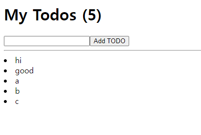

## ReactJS로 영화 웹서비스 만들기

### 0. npx create-react-app

> react app 만들기

```shell
$ npx create-react-app <앱이름>
```

> 파일 삭제

- src 폴더 내에 App.js와 index.js 제외한 필요없는 파일 삭제

<br>

### 1. TODOLIST PART1&2



- useState를 "react"에서 import 한 뒤, [toDo, setToDo] = useState('') 처럼 사용
  - toDo = '' 기본값으로 설정되고
  - const onChange = (event) => setToDo(event.target.value) 하면 toDo갱신
-  map 메서드 사용할때 vue에서 for쓸 때, key적어줘야 했던 것처럼 key를 할당해줘야하는데 두번째 인자로 index를 받아서 key={index}로 할당해주면 된다.
