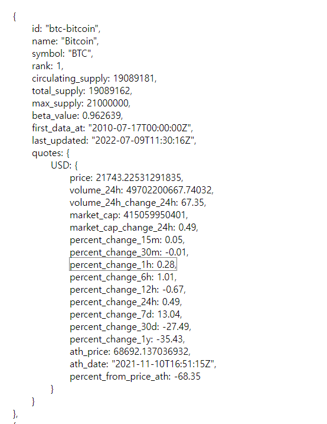
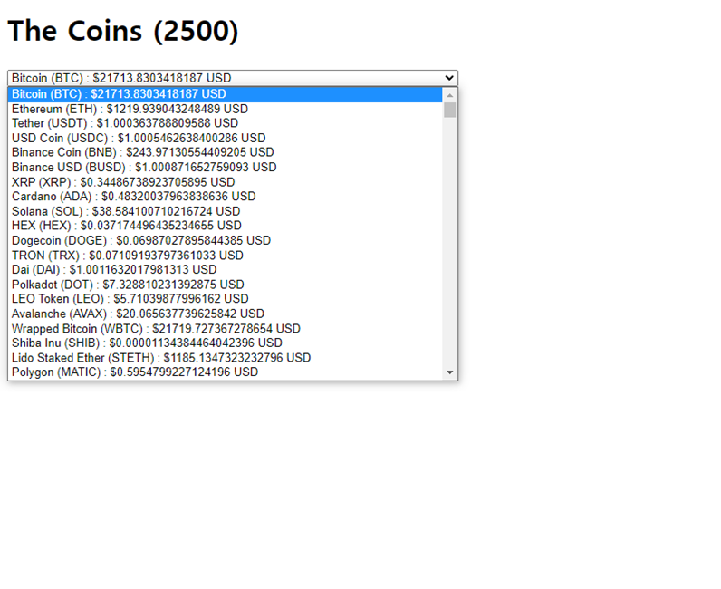

## Coins

[api](https://api.coinpaprika.com/v1/tickers)



```react
useEffect(() => {
    fetch('https://api.coinpaprika.com/v1/tickers')
    .then(res => res.json())
    .then(json => {
      setCoins(json)
      setLoading(false)
    })
  },[])
```

- fetch로 가져와서 json으로 변경하고 coins란 리스트에 넣는다.  그 후 map함수로 select -> option에 넣어주면


