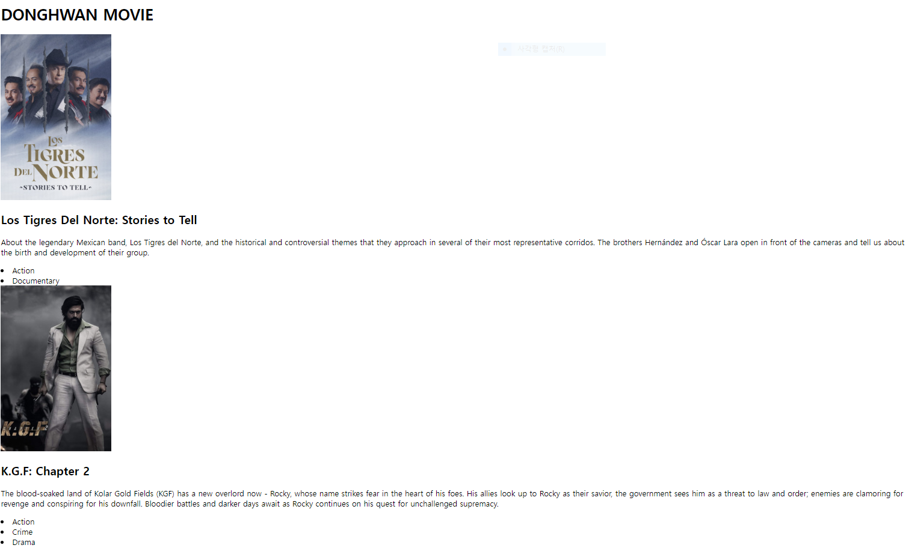

## Movie app

- [JSX html태그 자동완성](https://velog.io/@swanious/React-HTML%ED%83%9C%EA%B7%B8-%EC%9E%90%EB%8F%99%EC%99%84%EC%84%B1-%EC%A0%81%EC%9A%A9%ED%95%98%EA%B8%B0)
- [CRLF will be replaced by LF 워닝 해결](https://blog.jaeyoon.io/2018/01/git-crlf.html)

> movie api

- [movie api](https://yts.mx/api/v2/list_movies.json?minimum_rating=8.5&sort_by=year)
- [movie detail api](https://yts.mx/api/v2/movie_details.json?movie_id=15527)

> async , await

```react
const getMovies = async() => {
    const response = await fetch('https://yts.mx/api/v2/list_movies.json?minimum_rating=8.5&sort_by=year')
    const json = await response.json()
    setMovies(json.data.movies)
    setLoading(false)
  }
useEffect(() => {
  getMovies()
}, [])
```

- async&await를 쓸때는 async 함수를 만들고 then이 필요한 자리에 await를 쓰고 변수에 할당해야함

<br>

> api로 데이터를 받아온 모습



<br>

> proptypes

- 대소문자가 매우 헷갈린다. 

```shell
$ npm i prop-types
```

```react
import PropTypes from 'prop-types';

Movie.propTypes = {
    id : PropTypes.number.isRequired,
    img : PropTypes.string.isRequired,
    title: PropTypes.string.isRequired,
    summary: PropTypes.string.isRequired,
    genres: PropTypes.arrayOf(PropTypes.string).isRequired,
}
```

<br>

> react-router

- [quickstart](https://v5.reactrouter.com/web/guides/quick-start)

```shell
$ npm i react-router-dom@6.3.0
```

> 강의는 5.3버전으로 했지만 지금 그렇게 하면 작동하지 않는다. 6.3. 버전을 다운로드받고 Switch 대신 Routes를 써야함.

```react
import {
  BrowserRouter as Router,
  Routes,
  Route
} from "react-router-dom"

function App() {
  return <Router>
    <Routes>
      <Route path="/" element={<Home />} />
      <Route path="/detail" element={<Detail />} />
    </Routes>
  </Router>
}
```

> Link
>
> <a>를 쓸때 화면 전체가 새로고침 되던 것을 방지, 화면이 새로고침 되지 않고 부드럽게 바뀜

```react
<Link to="/detail">{title}</Link>
```

<br>

### 폴더구조

- src 내부에 routes폴더, component폴더 따로 관리하는 것이 좋음
  - routes > Detail.js, Home.js
  - component > Movie.js
  - 그 밖에 App.js, index.js

<br>

### deploy

```shell
$ npm i gh-pages
$ npm run build
```

> package.json

```json
"scripts": {
    "start": "react-scripts start",
    "build": "react-scripts build",
    "test": "react-scripts test",
    "eject": "react-scripts eject",
    "deploy": "gh-pages -d build",
    "predeploy": "npm run build"
  },
"homepage": "https://onghwand.github.io/Nomad"
```

```shell
$ npm run build
```

