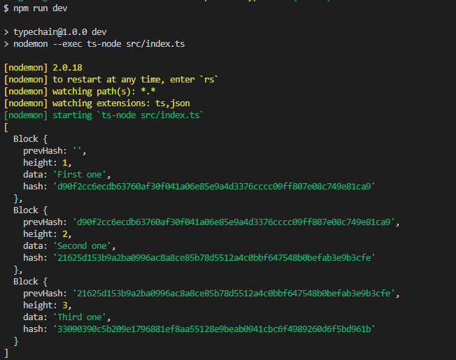

## 0.시작

```shell
$npm init -y
# "test": "echo \"Error: no test specified\" && exit 1" 삭제
# "main": "index.js" 삭제
$npm install -D typescript
```

- src 폴더 생성
  - index.ts 파일 생성
- `tsconfig.json` 파일 생성 => 타입스크립트로 작업한다는 것을 알려줌

<br>

## 1.ts => js 컴파일(build)

> tsconfig.json

```typescript
{
    "include": ["src"], // 컴파일할 ts파일 있는 폴더이름
    "compilerOptions": {
        "outDir": "build", // 컴파일된 js 폴더이름 
        "target": "ES6" // js 버전 기본값 es3
    }
}
```

> package.json

```javascript
{
  "name": "typechain",
  "version": "1.0.0",
  "description": "",
  "scripts": {
    "build": "tsc"
  },
  "keywords": [],
  "author": "",
  "license": "ISC",
  "devDependencies": {
    "typescript": "^4.7.4"
  }
}
```

> bash

```shell
$ npm run build
# build폴더에 컴파일된 js파일 생겼는지 확인
```

<br>

## 2. 모듈 import 하기 전에

> type 지정해주는 d.ts. 파일을 각 node 모듈에 대해 불러오는 역할

```shell
$ npm i -D @types/node
```

<br>

## 3. Blockchain 


